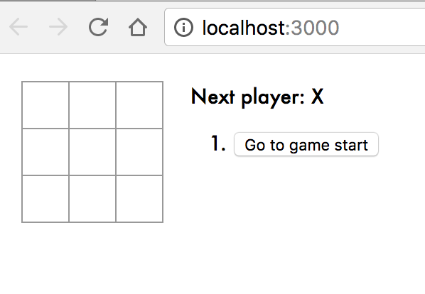
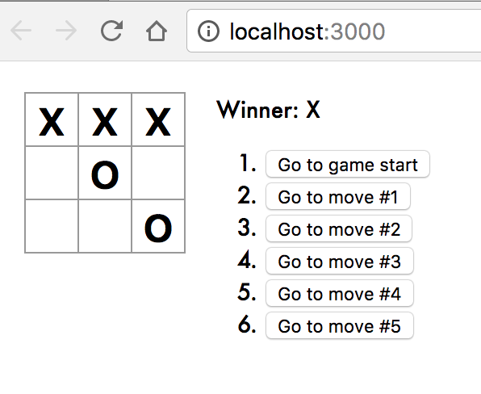
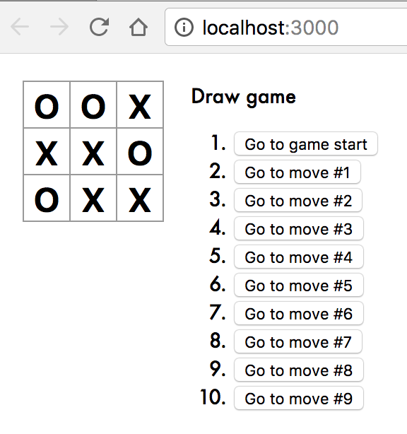

# Interactive tic-tac-toe app built with React 

## Reference 
[https://reactjs.org/tutorial/tutorial.html](https://reactjs.org/tutorial/tutorial.html)

## Build and Run 
`git clone https://github.com/shaeqkhan/tic-tac-toe.git`  
`cd tic-tac-toe`  
`npm start`  

Open [http://localhost:3000](http://localhost:3000) to view it in the browser.

## Sample
    
    
